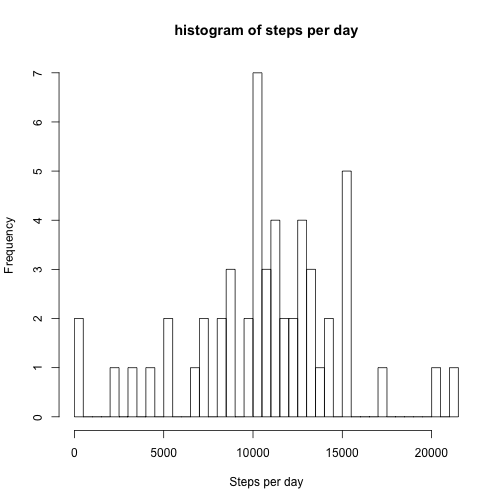
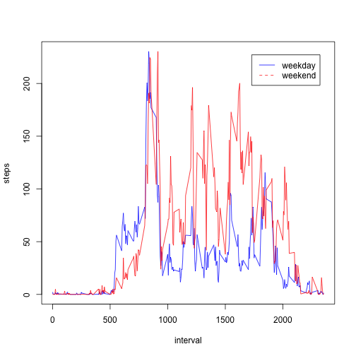

# Part 1
  
## Load and preprocessing data

Load the data from csv file. I didn't preocess anything because data type doesn't matter for the rest of work.


```r
activity <- read.csv("activity.csv")
act_data <- activity
```

Then using aggregate function, calculate total number of steps taken per day and draw a histogram of it.


```r
act_steps <- aggregate(steps ~ date, FUN=sum, data=act_data, na.rm=TRUE)

hist(act_steps$steps, main="histogram of steps per day", xlab="Steps per day", breaks=62)
```



Daily mean and median are 10766.189 and 10765, respectively.


```r
  steps_mean <- mean(act_steps$steps, na.rm=TRUE)
  steps_median <- median(act_steps$steps, na.rm=TRUE)
```


## Average daily activity pattern

Calculat average number of steps in a 5-minute interval fo all days.


```r
steps_interval <- aggregate(act_data$steps, by=list(interval=act_data$interval), FUN=mean, na.rm=TRUE)
colnames(steps_interval) <- c("interval", "avg_steps")
plot(steps_interval, type="l", ylab="steps")
```


```r
# find meximum value
max_interval <- steps_interval[which.max(steps_interval$avg_steps),]
```

The maximum step is 206.17 of interval 835.


# Part 2

## Imputing missing value

Total number of missing values are 2304.
Missing values can be imputed by average number of steps of a day, but there are some days don't have any data.
For this reason, average steps of the interval in a day(which is calculated above) is applied.


```r
act_imp <- activity

# Find total number of missing values
missing <- sum(is.na(act_imp$steps))

# Impute missing value
i=1;
for(i in 1:nrow(act_imp)){
        if(is.na(act_imp$steps[i])==TRUE){
                imp_value <- subset(steps_interval, select=avg_steps, act_imp$interval[i]==steps_interval$interval)
                act_imp$steps[i] <- as.numeric(imp_value)
        }
}

summary(act_imp)
```

```
##      steps             date          interval   
##  Min.   :  0   2012-10-01:  288   Min.   :   0  
##  1st Qu.:  0   2012-10-02:  288   1st Qu.: 589  
##  Median :  0   2012-10-03:  288   Median :1178  
##  Mean   : 37   2012-10-04:  288   Mean   :1178  
##  3rd Qu.: 27   2012-10-05:  288   3rd Qu.:1766  
##  Max.   :806   2012-10-06:  288   Max.   :2355  
##                (Other)   :15840
```

Summary shows there is no NA now.

mean and median of daily steps before imputing and after are compared.


```r
library(dplyr)


# Calculated total number of steps taken each day
act_imp_day <- act_imp %>%
                        group_by(date) %>%
                        summarize(avg_steps = sum(steps))

# Get mean and median
mean_imp <- mean(act_imp_day$avg_steps)
median_imp <- median(act_imp_day$avg_steps)

# show the result
res <- c("","w/o Imputing", "w/ Imputing", "Difference")
res_mean <- c("Mean", steps_mean, mean_imp, steps_mean - mean_imp)
res_median <- c("Median", steps_median,median_imp, steps_median-median_imp)

diff<- data.frame(res, res_mean, res_median)
print(diff)
```

```
##            res         res_mean       res_median
## 1                          Mean           Median
## 2 w/o Imputing 10766.1886792453            10765
## 3  w/ Imputing 10766.1886792453 10766.1886792453
## 4   Difference                0 -1.1886792452824
```

They have almost the same mean and median.


```r
  summary(act_steps$steps)
```

```
##    Min. 1st Qu.  Median    Mean 3rd Qu.    Max. 
##      41    8840   10800   10800   13300   21200
```

```r
  summary(act_imp_day$avg_steps)
```

```
##    Min. 1st Qu.  Median    Mean 3rd Qu.    Max. 
##      41    9820   10800   10800   12800   21200
```

But the summary shows that 1st quantile of imputed data is larger than original data.
That means imputed data are more concentrated around the mean.

# Difference in activity patterns

Add new column that indicate date is weekday or weekend.


```r
act_imp$isWeekday <- ifelse(weekdays(as.Date(act_imp$date)) %in% c("Saturday","Sunday"),"Weekend","Weekday")

# calculate average number of steps in a time slot by weekday and weekend.
act_imp_weekday <- act_imp %>% 
                filter(isWeekday=="Weekday")
act_imp_interval_weekday <- aggregate(steps ~ interval, FUN=mean, data=act_imp_weekday)
colnames(act_imp_interval_weekday) <- c("interval", "avg_steps_weekday")

act_imp_weekend <- act_imp %>%
                filter(isWeekday=="Weekend")
act_imp_interval_weekend <- aggregate(steps ~ interval, FUN=mean, data=act_imp_weekend)
colnames(act_imp_interval_weekend) <- c("interval", "avg_steps_weekend")

# merge the average steps in a data frome
act_imp_week_plot <- merge(act_imp_interval_weekday, act_imp_interval_weekend, by='interval')

# Plot
plot(act_imp_week_plot$interval, act_imp_week_plot$avg_steps_weekday, type="l", col="blue", xlab="interval", ylab="steps")
par(new=T)
plot(act_imp_week_plot$interval, act_imp_week_plot$avg_steps_weekend, type="l", col="red", xlab="", ylab="", axes=FALSE)

legend("topright", inset=0.05, c("weekday","weekend"), lty=c(1,2),col=c("blue","red"))
```



This plot reveals that more activities are occured in weekends.
